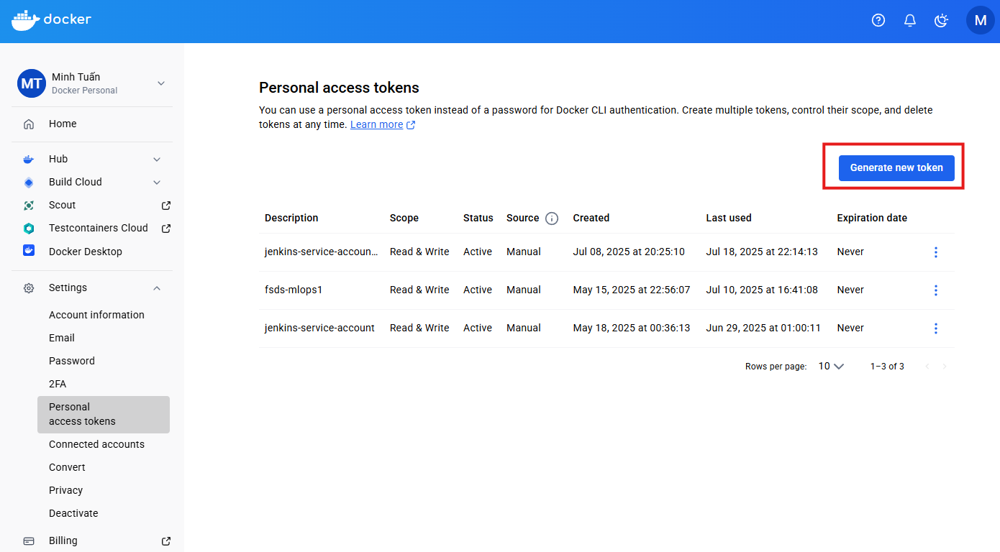
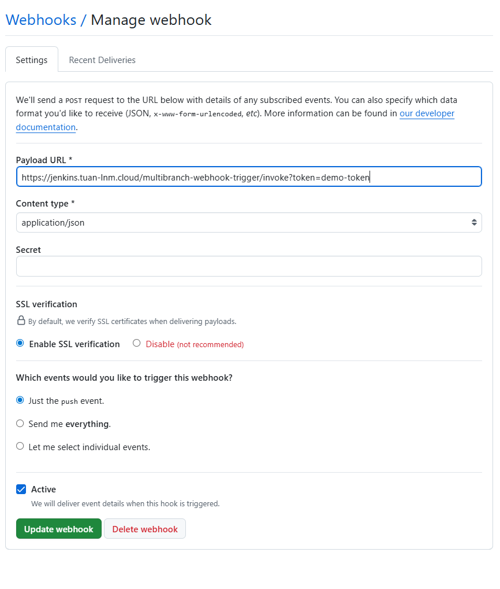
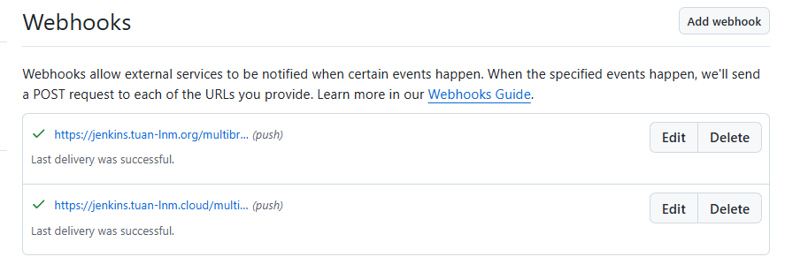
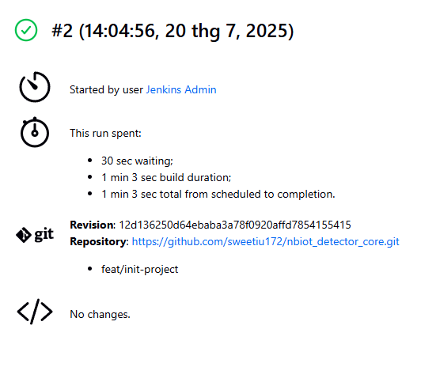

# nbiot_detector_core

## 📕 Table Of Contents

<!--ts-->

- [🌟 System Architecture](#-system-architecture)
- [📁 Repository Structure](#-repository-structure)
- [🚀 Getting Started](#-getting-started)
- [🔌 Exposing Services](#-exposing-services)
- [🔧 Addtional Setup](#-additional-setup)
- [🧹 Cleanup](#-cleanup)

## 🌟 System Architecture
<p align="center">


<p align="center">
    System Architecture
</p>

## 📁 Repository Structure
```bash
./nbiot_detector_core/
├── Jenkinsfile
├── README.md
├── app
│   ├── Dockerfile
│   ├── __init__.py
│   ├── main.py
│   ├── model_definition.py
│   ├── requirements.txt
│   └── saved_assets
├── docker-compose.yaml
├── document
├── example.csv
├── images
├── kubernetes
│   ├── Dockerfile.jenkins
│   ├── Dockerfile.jenkins-agent
│   ├── base
│   │   ├── argocd
│   │   │   ├── elasticsearch.yaml
│   │   │   ├── filebeat.yaml
│   │   │   ├── jaeger.yaml
│   │   │   ├── jenkins.yaml
│   │   │   ├── kibana.yaml
│   │   │   └── nbiot-detector.yaml
│   │   ├── cloudflare-ingress.yaml
│   │   ├── cluster-issuer.yaml
│   │   ├── google-ingress.yaml
│   │   ├── ingress.yaml
│   │   ├── jenkins-01-volume.yaml
│   │   ├── jenkins-rbac-ssh.yaml
│   │   └── jenkins-sa-rbac.yaml
│   └── helm
│       ├── app-nbiot-detector
│       ├── argo-cd
│       ├── cert-manager
│       ├── cloudflare-tunnel-remote
│       ├── elasticsearch
│       ├── filebeat
│       ├── ingress-nginx
│       ├── jaeger-all-in-one
│       ├── jenkins
│       ├── kibana
│       └── kube-prometheus-stack
├── local
│   ├── alertmanager
│   ├── elk
│   ├── grafana
│   └── prometheus
├── notebooks
│   ├── lightgbm.ipynb
│   └── main.ipynb
├── pytest.ini
├── scripts
│   ├── bootstrap.sh
│   ├── cleanup.sh
│   ├── grant-permission-for-certmanager.sh
│   └── manual-delete-kibana.sh
├── terraform
│   ├── main.tf
│   ├── outputs.tf
│   ├── prod.tfvars
│   └── variables.tf
└── tests
    ├── __init__.py
    ├── conftest.py
    ├── deleted.test_main.py
    ├── test_main_endpoints.py
    ├── test_predict_batch.py
    └── test_predict_single.py
```

## 🚀 Quick start

### 1. Prerequisites 🔧

Before you begin, ensure you have the following command-line tools installed and configured:
* **`git`**: To clone the repository.
* **`kubectl`**: To interact with the Kubernetes cluster.
* **`helm`**: To manage Kubernetes packages (version 3+).
* **`docker`**: To containerize the application (version 25+).
* **`gcloud`** (For Production): To authenticate with Google Cloud. Ensure you've authenticated by running `gcloud auth login` and `gcloud auth application-default login`.
* **`terraform`** (For Production): To provision the cloud infrastructure.
* **`minikube`** (For Local): To run a local Kubernetes cluster.

### 2. Initial Setup

First, clone the repository to your local machine.

```bash
git clone <repository-url>
cd nbiot_detector_core/
```

### 3. Deployment Instructions

The `bootstrap.sh` script handles both production and local deployments. You must run it from the `scripts/` directory.

### Production Deployment (GKE)

This process will provision a new GKE cluster and deploy all the services.

**Step 1: Configure Terraform Variables**
Before running the script, you must configure your Google Cloud settings. Edit the Terraform variables file:

**File to Edit:** `terraform/prod.tfvars`

Update the file with your specific GCP `project_id` and desired `region`
```terraform
# terraform/prod.tfvars

project_id          = "your-gcp-project-id"
region              = "asia-southeast1"
deletion_protection = false
node_count          = 3
machine_type        = "e2-standard-2"
```

**Step 2: Run the Bootstrap Script**

Login to GCP with CLI
```shell
gcloud auth application-default login
```

Navigate to the `scripts` directory and execute the bootstrap script with the `prod` argument.

```bash
cd scripts/
bash bootstrap.sh prod
```

The script will now perform the following actions:
1.  **Initialize Terraform** and apply the configuration to create the GKE cluster.
2.  **Configure `kubectl`** to connect to your new GKE cluster.
3.  **Create Kubernetes namespaces** for all components (`monitoring`, `logging`, `jenkins`, etc.).
4.  **Deploy Helm charts** for Nginx, Prometheus (`kube-prometheus-stack`), ArgoCD, and the Cloudflare Tunnel.
5.  **Apply base Kubernetes manifests**, including persistent volumes for Jenkins.
6.  **Apply ArgoCD application manifests** to manage the core services.
    * **Note:** The script includes a **6-minute pause** after deploying Elasticsearch to allow it to initialize properly before other components that depend on it are created.

#### Local Deployment (Minikube)
This process uses Minikube to create a local Kubernetes cluster for testing. Navigate to the `scripts` directory and run the script with the `local` argument.
```bash
cd scripts/
bash bootstrap.sh local
```
The script will:
1.  **Start Minikube**.
2.  Perform the same namespace, Helm chart, and manifest deployments as the production environment, but within your local Minikube cluster.


## 🔌 Exposing Services
After the `bootstrap.sh` script completes,  you need to expose the services to access them. The following methods apply to the **Production (GKE) Deployment**.

### [Option 1: Ingress without SSL (Using nip.io)](./document/Option1.md)


### [Option 2: Ingress with Google Cloud DNS and Let's Encrypt SSL](./document/Option2.md)
This method provides a secure setup using your own domain managed by Google Cloud DNS.


### [Option 3: Ingress with Cloudflare Tunnel (Recommended)](./document/Option3.md)
This method simplifies the architecture and enhances security by using a Cloudflare Tunnel. No ports need to be opened on your firewall.

## 🔧 Additional Setup

### Jenkins setup

***Notice:*** I will assume that you have a docker hub account and have your own docker's repositories

**Step 1:** Create docker access token
1. **Login to Docker Hub**
2. `Account settings` > `Personal access tokens` > `Generate new token` (with Read & Write scope)

3. **Keep your token handy**

**Step 2:** Create github webhook
1. Go to the GitHub repository and click on `Settings`
2. Click on `Webhooks` and then select `Add Webhook`
3. Enter URL of your Jenkins server (https://jenkins.tuan-lnm.cloud/multibranch-webhook-trigger/invoke?token=demo-token)

3.1. Note that you can use any token's name that you want, mine was `demo-token` <br>
3.2 For deployment with option 1, please choose SSL verfication disable

4. Webhook's status should be `green`


**Step 3**: Setup github access token
1. Create your own ssh key
```bash
ssh-keygen -t rsa -b 4096 -C "jenkins@k8s" -f id_rsa_jenkins -N ""
```

2. Go to the GitHub repository and click on `Settings`
3. Click on `Deploy keys` and then Select `Add Deploy key`
4. Paste in your public key `id_rsa_jenkins.pub`
5. Create github-ssh-key secret
```bash
kubectl create secret generic github-ssh-key --namespace=jenkins --type=kubernetes.io/ssh-auth
--from-file=ssh-privatekey=./id_rsa_jenkins
```

**Step 4**: Setup CI Pipeline
1. Go to `Jenkins` dashboard and click on `New Item`
2. Name your project (eg. `nbiot-detector`) and select `Multibranch Pipeline`
3. Click on `Branch Sources` and then click on `Add Source`. Select `GitHub` and click on `Add`. Enter the URL of your GitHub repository.
4. At `Scan Multibranch Pipeline Triggers`, choose `Scan by webhook`. Enter `demo-token` (or your token name at step 2).
5. At `Registry credentials`, click on `Add` > `Jenkins`. Enter your Username, Password (Docker access token) and ID=`docker-jenkins`.
6. Click `Save`. Your pipeline should be green



## 🧹 Cleanup
To tear down all deployed resources, use the `cleanup.sh` script from the `scripts/` directory.

### Production Cleanup
This will destroy the GKE cluster and all other resources created by Terraform.
```bash
cd scripts/
bash cleanup.sh prod
```
### Local Cleanup
This will delete the Minikube cluster.
```bash
cd scripts/
bash cleanup.sh local
```