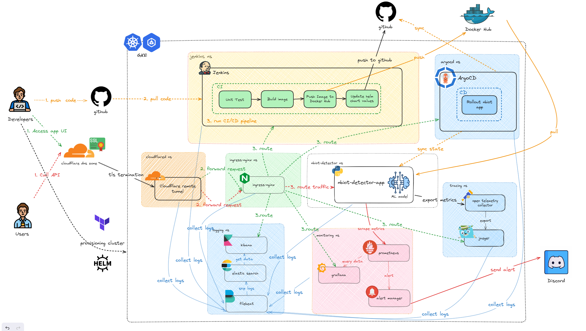

# nbiot_detector_core

## 📕 Table Of Contents

<!--ts-->

- 🌟 [System Architecture](#️-system-architecture)
- 📁 [Repository Structure](#-repository-structure)
- 🚀 [Getting Started](#-getting-started)
- 🔍 [How to Guide](#-how-to-guide)
- 📌 [References](#-references)

## 🌟 System Architecture
<p align="center">


<p align="center">
    System Architecture
</p>

## 📁 Repository Structure
```shell
./nbiot_detector_core/
├── Dockerfile
├── Jenkinsfile
├── README.md
├── app
│   ├── main.py
│   ├── model_definition.py
│   ├── requirements.txt
│   └── saved_assets
│       ├── best_nbiot_detector.pth
│       └── nbiot_multi_device_scaler.gz
├── docker-compose.yaml
├── example.csv
├── kubernetes
│   ├── Dockerfile.jenkins
│   ├── Dockerfile.jenkins-agent
│   ├── base
│   │   ├── ingress.yaml
│   │   ├── jenkins-01-volume.yaml
│   │   └── jenkins-helm-role-and-role-binding.yaml
│   └── helm
│       ├── app-nbiot-detector
│       ├── elasticsearch
│       ├── filebeat
│       ├── ingress-nginx
│       ├── jaeger-all-in-one
│       ├── jenkins
│       ├── kibana
│       └── kube-prometheus-stack
├── local
├── main.ipynb
├── pytest.ini
├── scripts
│   ├── bootstrap.sh
│   └── cleanup.sh
├── terraform
│   ├── main.tf
│   ├── mlops.tfvars
│   ├── outputs.tf
│   └── variables.tf
└── tests
    ├── __init__.pyc
    └── test_main.py
```