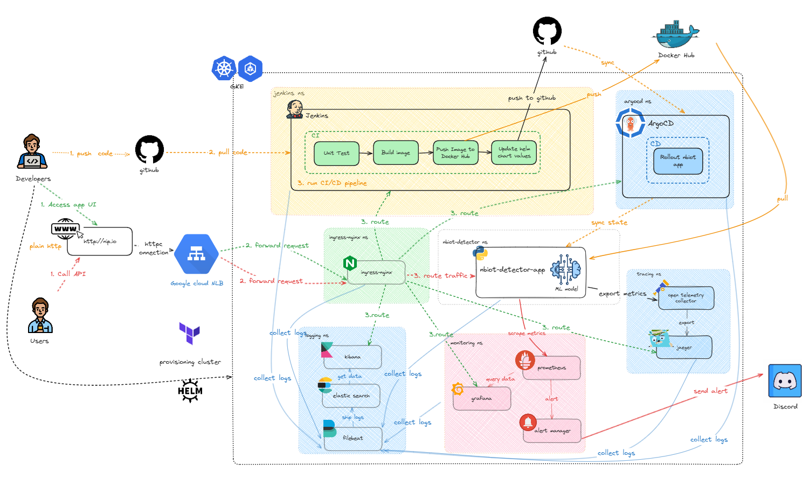

**High-level architecture**


**Step 1: Install the Ingress Controller** <br>
Navigate to the `kubernetes/helm` directory and install the `ingress-nginx` chart with a specific configuration for a public-facing Network Load Balancer (NLB).

```bash
helm -n ingress-nginx upgrade --install ingress-nginx ./ingress-nginx -f ./ingress-nginx/values.non-cloudflare.yaml
```

**Step 2: Get the External IP** <br>
Wait a minute or two for Google Cloud to provision the NLB, then get its external IP address.
```bash
export EXTERNAL_IP=$(kubectl get service ingress-nginx-controller \
  --namespace ingress-nginx \
  --output jsonpath='{.status.loadBalancer.ingress[0].ip}')
echo "External IP: $EXTERNAL_IP"
```
> **Note:** Keep this IP address. You'll need it to access the services.

**Step 3: Apply Ingress Resources** <br>
Update the placeholder in `kubernetes/base/ingress.yaml` with your `$EXTERNAL_IP` and apply it. (Or use `sed` to replace it automatically).
```yaml
apiVersion: networking.k8s.io/v1
kind: Ingress
metadata:
  name: app
  namespace: nbiot-detector
spec:
  ingressClassName: nginx
  rules:
    - host: app.$EXTERNAL_IP.nip.io # 👈 Replace with your external IP
      http:
        paths:
          - pathType: Prefix
            backend:
              service:
                name: nbiot-detector-app-nbiot-detector
                port:
                  number: 8000
            path: /
```
After replacing all $EXTERNAL_IP with your actual external IP. Run `kubectl apply` command
```bash
kubect apply -f ./kubernetes/base/ingress.yaml
```
**Available URLs:**
* **ArgoCD:** `http://argocd.$EXTERNAL_IP.nip.io`
* **Jenkins:** `http://jenkins.$EXTERNAL_IP.nip.io`
* **Grafana:** `http://grafana.$EXTERNAL_IP.nip.io`
* **Kibana:** `http://kibana.$EXTERNAL_IP.nip.io`
* **Jaeger UI:** `http://jaeger.$EXTERNAL_IP.nip.io`
* **Application:** `http://app.$EXTERNAL_IP.nip.io`