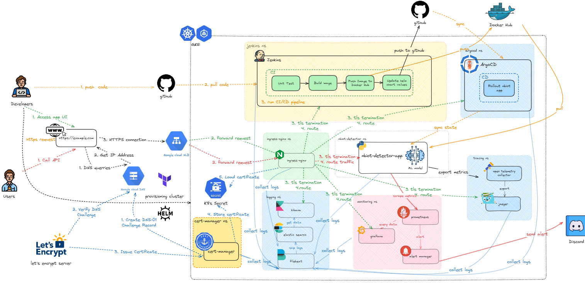

**High-level architecture**


**Prerequisites:** You must have a domain managed by **Google Cloud DNS**.


Verify if DNS is managed by Google
```bash
$ dig tuan-lnm.cloud

; <<>> DiG 9.18.30-0ubuntu0.22.04.2-Ubuntu <<>> tuan-lnm.cloud
;; global options: +cmd
;; Got answer:
;; ->>HEADER<<- opcode: QUERY, status: NOERROR, id: 18136
;; flags: qr rd ra; QUERY: 1, ANSWER: 0, AUTHORITY: 1, ADDITIONAL: 1

;; OPT PSEUDOSECTION:
; EDNS: version: 0, flags:; udp: 4096
;; QUESTION SECTION:
;tuan-lnm.cloud.                        IN      A

;; AUTHORITY SECTION:
tuan-lnm.cloud.         300     IN      SOA     ns-cloud-b1.googledomains.com. cloud-dns-hostmaster.google.com. 1 21600 3600 259200 300

;; Query time: 0 msec
;; SERVER: 10.255.255.254#53(10.255.255.254) (UDP)
;; WHEN: Sun Jul 20 16:00:31 +07 2025
;; MSG SIZE  rcvd: 136
```

Delete ingress resources from *step 1*
```yaml
kubect delete -f ./kubernetes/base/ingress.yaml
```

**Step 1: Create an 'A' Record in Cloud DNS** <br>
Create an A record in your Cloud DNS managed zone to point your desired domain to the NLB's external IP address.
1. Go to the ***Cloud DNS*** page in the Google Cloud Console.
2. Select your managed zone (e.g., your-domain.com).
3. Click ***Add Standard***.
4. Fill in the details:
 * ***DNS Name***: The subdomain you want to use (e.g., app).
 * ***Record Type***: A
 * ***IPv4 Address***: The external IP you got from the previous step.
5. Click ***Create***.

**Step 2: Set Up Cert-Manager for Cloud DNS** <br>

`cert-manager` handles the certificate lifecycle. We need to install it and grant it permission to modify Cloud DNS records to solve the Let's Encrypt challenge.

1.  **Create a GCP Service Account:** Run the `grant-permission-for-certmanager.sh` script after setting your project ID inside the file. This creates a service account with `dns.admin` rights and generates a `key.json` file.
```bash
GCP_PROJECT_ID="nbiot-detector"
SA_NAME="cert-manager-dns01"

# Create the service account
gcloud iam service-accounts create ${SA_NAME} \
  --display-name="Service account for cert-manager DNS01 solver"

# Grant it the DNS Administrator role
gcloud projects add-iam-policy-binding ${GCP_PROJECT_ID} \
  --member="serviceAccount:${SA_NAME}@${GCP_PROJECT_ID}.iam.gserviceaccount.com" \
  --role="roles/dns.admin"

# Create and download a key for the service account
gcloud iam service-accounts keys create key.json \
  --iam-account="${SA_NAME}@${GCP_PROJECT_ID}.iam.gserviceaccount.com"
```

2. **Install Cert-Manager:**
Navigate to `kubernetes/helm/cert-manager` and run following command:
```bash
helm upgrade --install cert-manager ./kubernetes/helm/cert-manager -f ./kubernetes/helm/cert-manager/values.extended.yaml -n cert-manager --create-namespace 
```

3. **Create a Kubernetes Secret** from the service account key:
```shell
kubectl create secret generic clouddns-sa-key \
  --namespace cert-manager \
  --from-file=key.json=key.json
```

4. **Create a ClusterIssuer:** Update `kubernetes/base/cluster-issuer.yaml` with your email and GCP project ID, then apply it.
```yaml
apiVersion: cert-manager.io/v1
kind: ClusterIssuer
metadata:
  name: letsencrypt-prod
spec:
  acme:
    server: https://acme-v02.api.letsencrypt.cloud/directory
    email: your-email@example.com # Replace with your email
    privateKeySecretRef:
      name: letsencrypt-prod-private-key
    solvers:
    - dns01:
        cloudDNS:
          project: your-gcp-project-id # Replace with your GCP project ID
          serviceAccountSecretRef:
            name: clouddns-sa-key
            key: key.json
```
```shell
kubectl apply -f ./kubernetes/base/cluster-issuer.yaml
```

**Step 3: Deploy the TLS-Enabled Ingress**
Update `kubernetes/base/google-ingress.yaml` with your domain name and apply it.
```yaml
apiVersion: networking.k8s.io/v1
kind: Ingress
metadata:
  name: app-google-dns
  namespace: nbiot-detector
  annotations:
    # Use cert-manager to issue the certificate for this Ingress
    cert-manager.io/cluster-issuer: "letsencrypt-prod"
spec:
  ingressClassName: nginx
  tls:
  - hosts:
    - app.tuan-lnm.cloud # 👈 Replace with your domain
    # cert-manager will store the certificate in this secret
    secretName: tls-secret-for-app 
  rules:
    - host: app.tuan-lnm.cloud # 👈 Replace with your domain
      http:
        paths:
          - pathType: Prefix
            backend:
              service:
                name: nbiot-detector-app-nbiot-detector
                port:
                  number: 8000
            path: /
```
```shell
kubectl apply -f ./kubernetes/base/google-ingress.yaml
```

You can now access your services securely via **Availabe URLs:**
* **ArgoCD:** `https://argocd.tuan-lnm.cloud`
* **Jenkins:** `https://jenkins.tuan-lnm.cloud`
* **Grafana:** `https://grafana.tuan-lnm.cloud`
* **Kibana:** `https://kibana.tuan-lnm.cloud`
* **Jaeger UI:** `https://jaeger.tuan-lnm.cloud`
* **Application:** `https://app.tuan-lnm.cloud`

**Step 4: Verify SSL/TLS certificate**
