**High-level architecture**
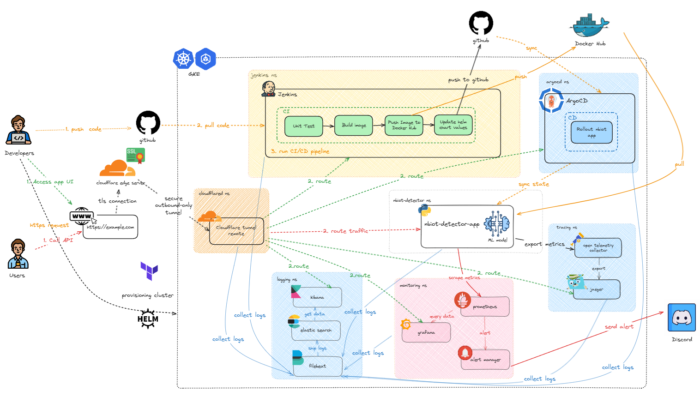

**Prerequisites:** You must have a domain managed by **Cloudflare**.
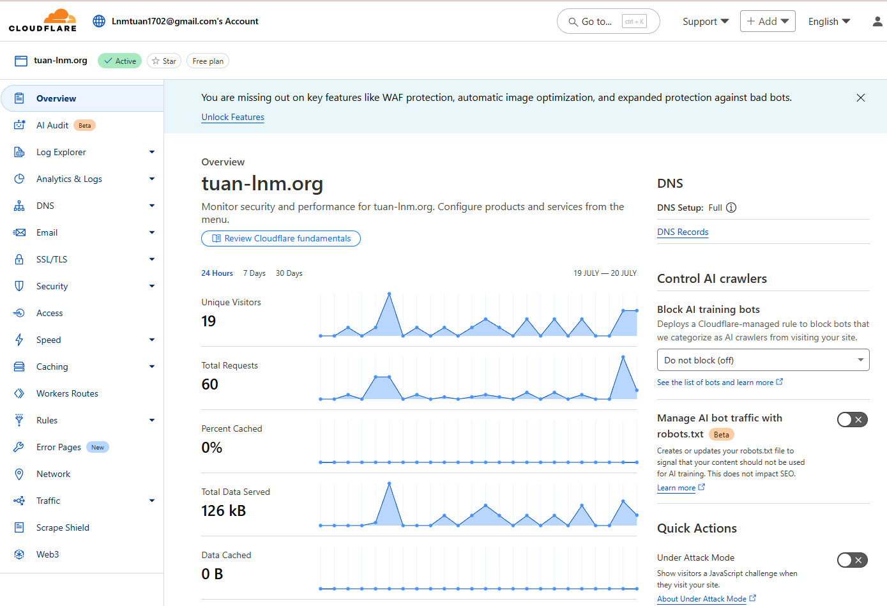


Verify if DNS is managed by Cloudflare
```bash
$ dig tuan-lnm.org

; <<>> DiG 9.18.30-0ubuntu0.22.04.2-Ubuntu <<>> tuan-lnm.org
;; global options: +cmd
;; Got answer:
;; ->>HEADER<<- opcode: QUERY, status: NOERROR, id: 10286
;; flags: qr rd ra; QUERY: 1, ANSWER: 2, AUTHORITY: 0, ADDITIONAL: 1

;; OPT PSEUDOSECTION:
; EDNS: version: 0, flags:; udp: 4096
;; QUESTION SECTION:
;tuan-lnm.org.                  IN      A

;; ANSWER SECTION:
tuan-lnm.org.           299     IN      A       104.21.21.121
tuan-lnm.org.           299     IN      A       172.67.198.154

;; Query time: 52 msec
;; SERVER: 10.255.255.254#53(10.255.255.254) (UDP)
;; WHEN: Sun Jul 20 17:28:36 +07 2025
;; MSG SIZE  rcvd: 73
```
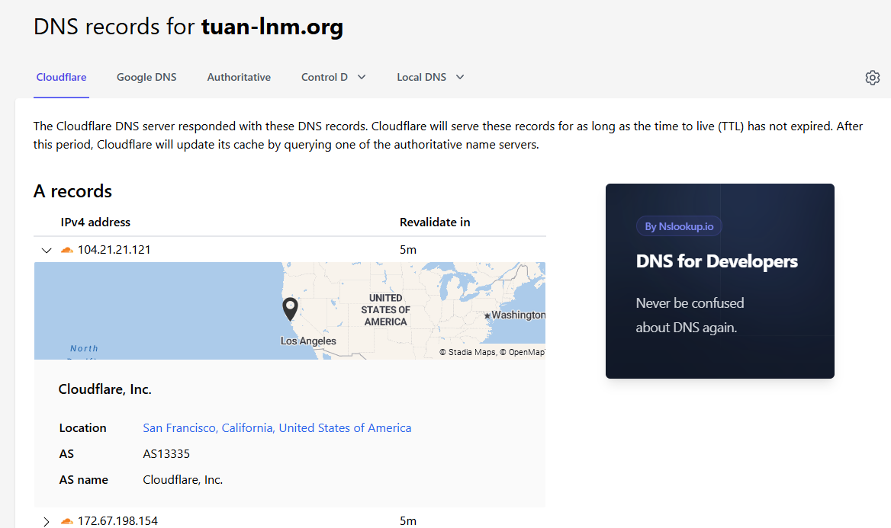


**Key advantages of this approach include:**
* World-class DDoS protection.
* No need to expose a public IP for your load balancer.
* Simplified architecture with free, managed TLS certificates.

**Step 1: Create a Cloudflare Tunnel**

**Create a cloudflare tunnel** <br>
1.  In the Cloudflare dashboard, navigate to **Zero Trust**.
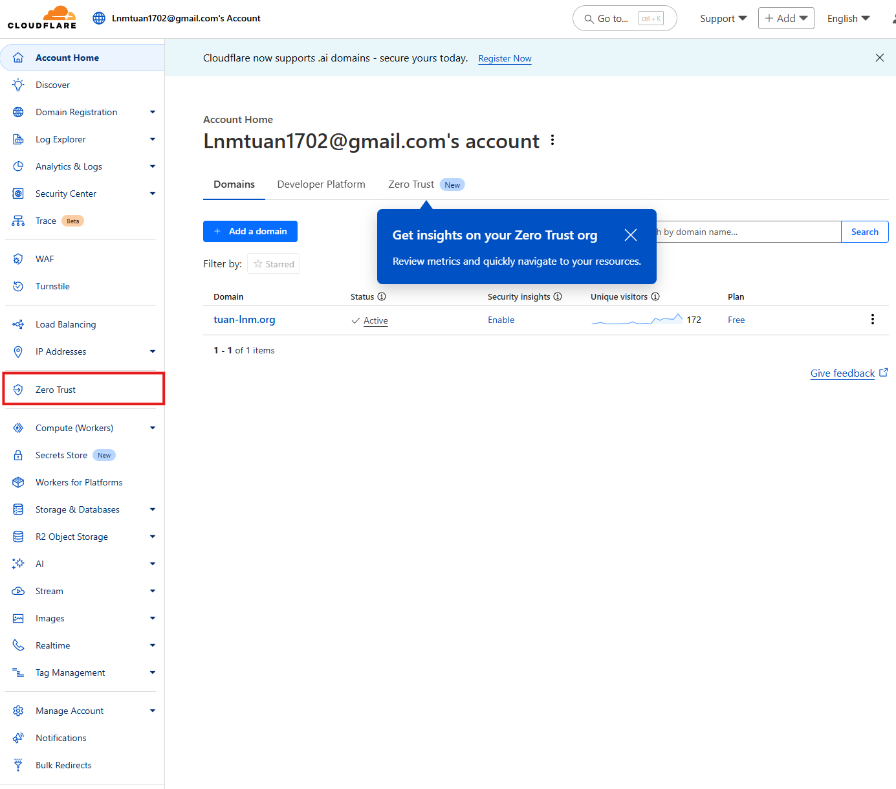

2.  Go to `Networks` > `Tunnels` and select **Create a tunnel**.
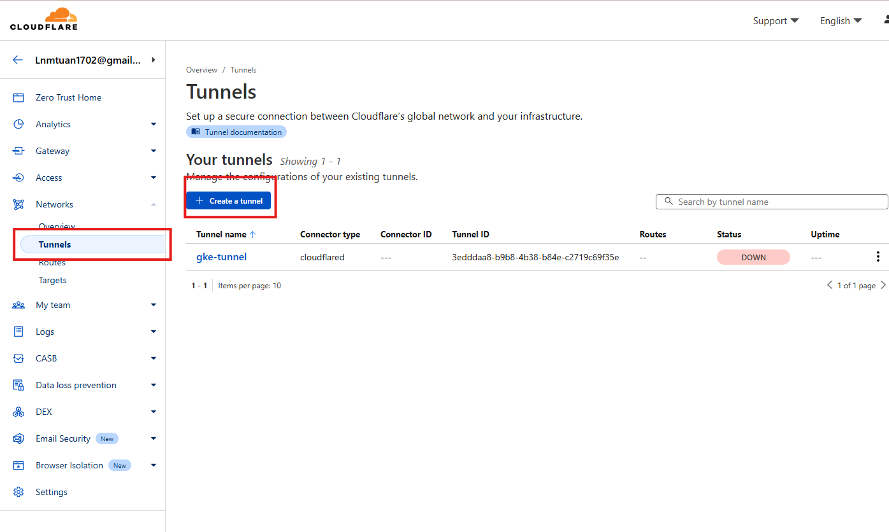

3.  Choose `Cloudflared` as the connector type, name your tunnel, and click **Save tunnel**.
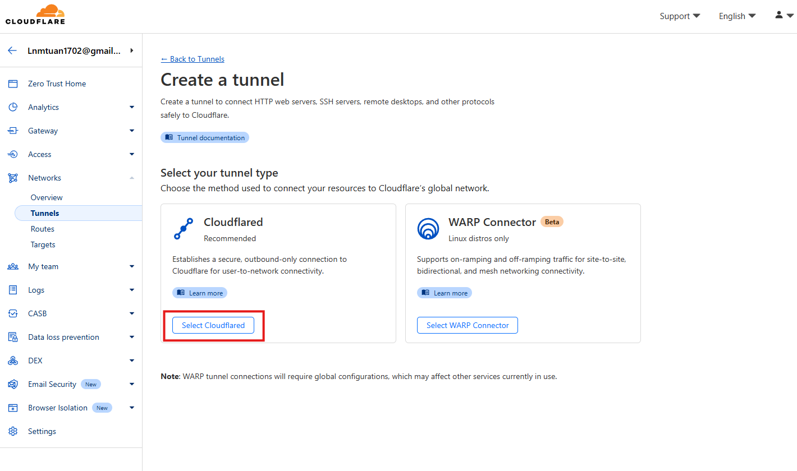

4.  Copy the token provided in the setup instructions.
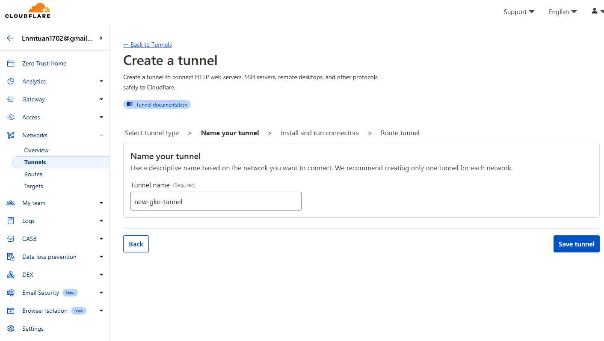

5. Save your cloudflare token.  It will look like a long alphanumeric string.
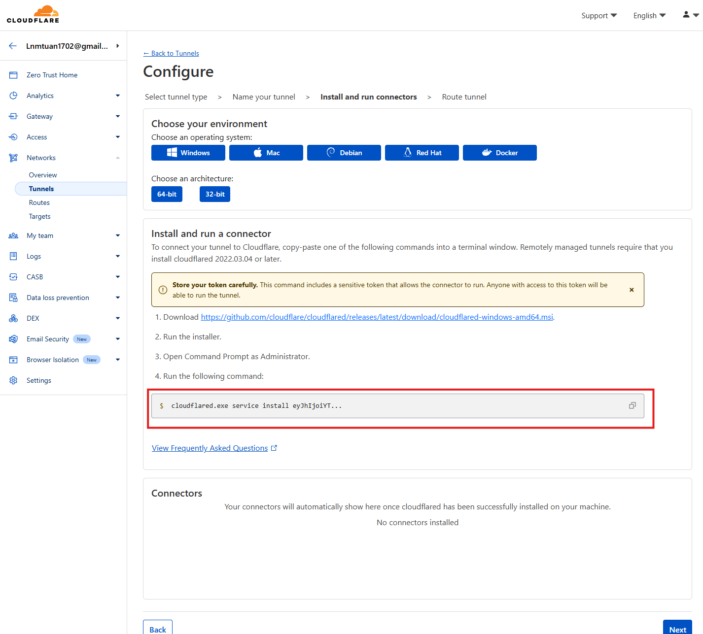

Your cloudflare token will be in this format

`eyJhIjoiYTBlZDJjYzBjOTE1NmMxMTEzMWI0NzgyYjQzYWM0NWMiLCJ0IjoiOTZhYmE5MjAtZDIwYi00ODlkLWE3ZjktNWQ2ZTJiMmRjNmJhIiwicyI6Ik1tVTJNR05tTkRZdE1qQXlPUzAwWVRNMkxXSTBObUl0WmpCa05UQmpORGd6WldabCJ9`

**Step 2: Deploy the Cloudflare Connector**
1.  Navigate to `kubernetes/helm/cloudflare-tunnel-remote/values.yaml` and paste your token.
```yaml
# kubernetes/helm/cloudflare-tunnel-remote/values.yaml
cloudflare:
    tunnel_token: "<your-token>"
```

2.  Install the `cloudflare-tunnel-remote` Helm chart.
```bash
helm -n cloudflared upgrade --install cloudflare-tunnel-remote ./cloudflare-tunnel-remote/ -f ./cloudflare-tunnel-remote/values.yam
```

- After installing cloudlflare-tunnel-remote, verify its status
```shell
$ kubectl get po -n cloudflared
NAME                                       READY   STATUS    RESTARTS   AGE
cloudflare-tunnel-remote-9cfd459c5-48bg7   1/1     Running   0          118s
cloudflare-tunnel-remote-9cfd459c5-9tk2k   1/1     Running   0          118s
```

**Step 3: Expose Services via Public Hostnames**
In your tunnel's dashboard on Cloudflare, click `Edit`
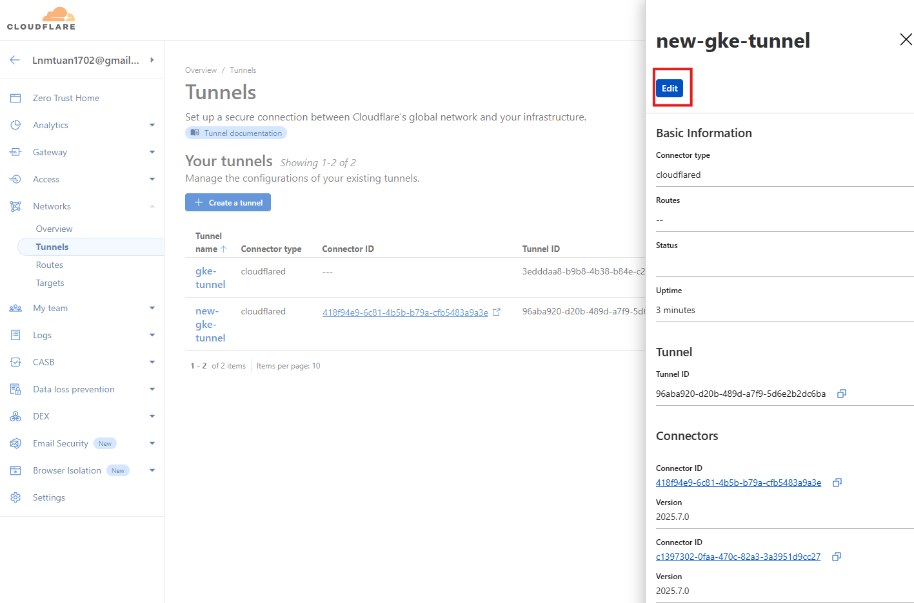

1. Navigate to the **Public Hostnames** tab.Click **Add a public hostname**.
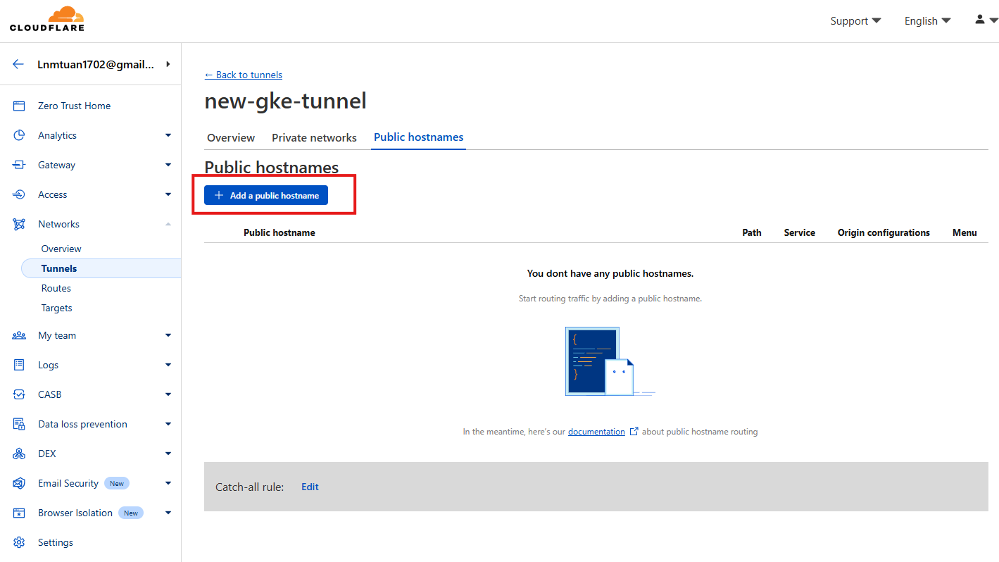, 

2.  Fill in the details for each service you want to expose.
    * **Subdomain:** `app`, `jenkins`, `argocd`, etc.
    * **Domain:** Your Cloudflare-managed domain.
    * **Type:** `HTTPS`
    * **URL:** The Kubernetes internal service address.
        > **Note:** The Kubernetes service endpoint is defined as `(service-name).(namespace).svc.cluster.local:(port)`. For example, for the main application, this would be `nbiot-detector-app-nbiot-detector.nbiot-detector.svc.cluster.local:8000`.


3. Apply the same for remaining services
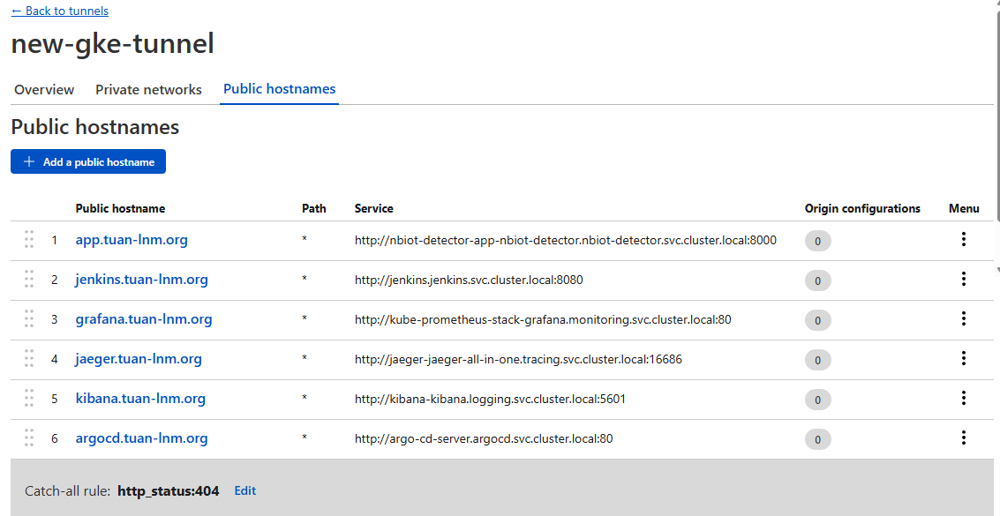


**Step 4: Apply the Cloudflare Ingress Resource**
```shell
$ kubectl apply -f ./kubernetes/base/cloudflare-ingress.yaml
ingress.networking.k8s.io/app created
ingress.networking.k8s.io/jenkins created
ingress.networking.k8s.io/grafana created
ingress.networking.k8s.io/jaeger created
ingress.networking.k8s.io/kibana created
ingress.networking.k8s.io/argocd created
```

**Step 5: Verify SSL/TLS certificate**
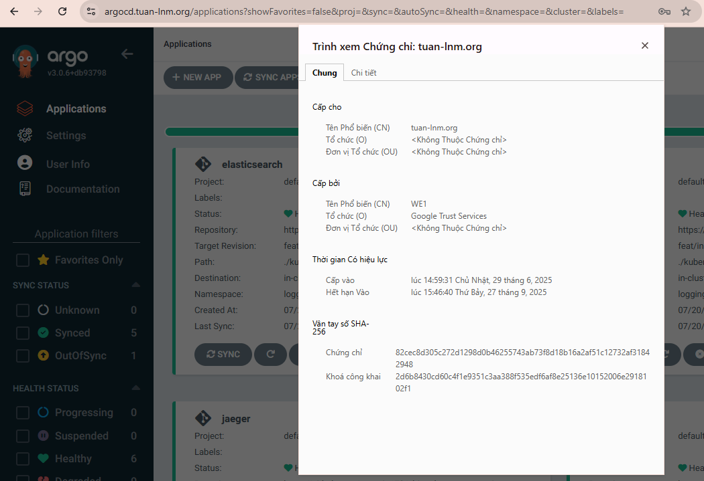